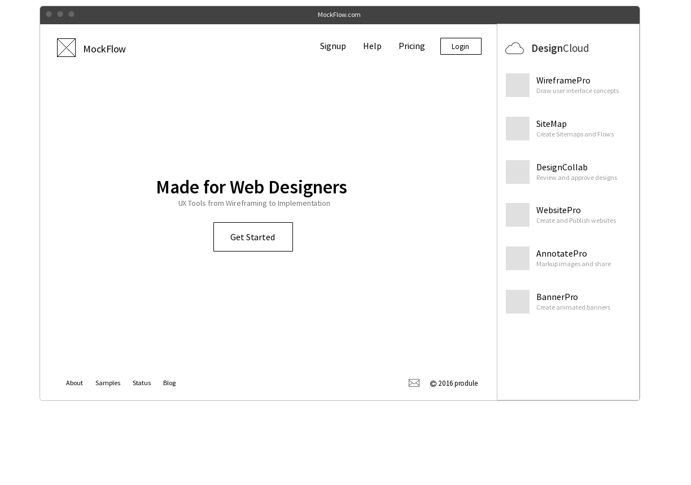
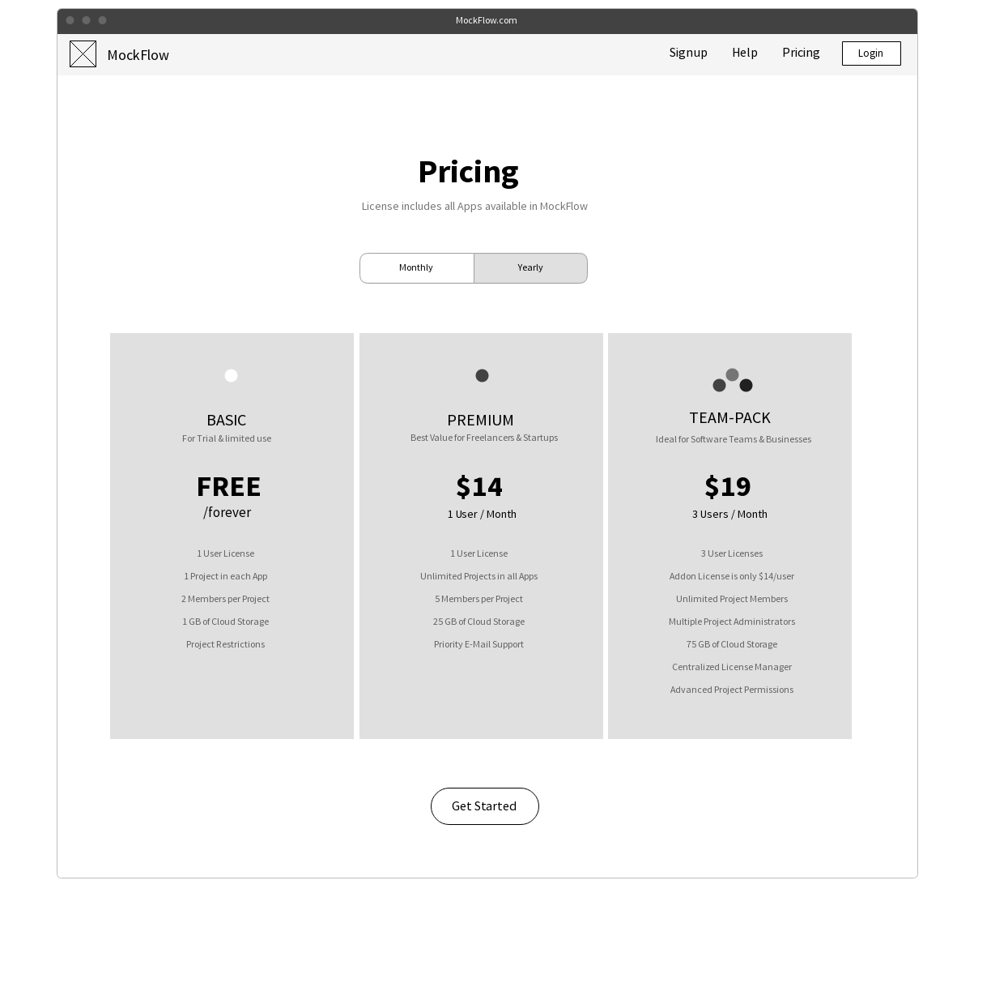
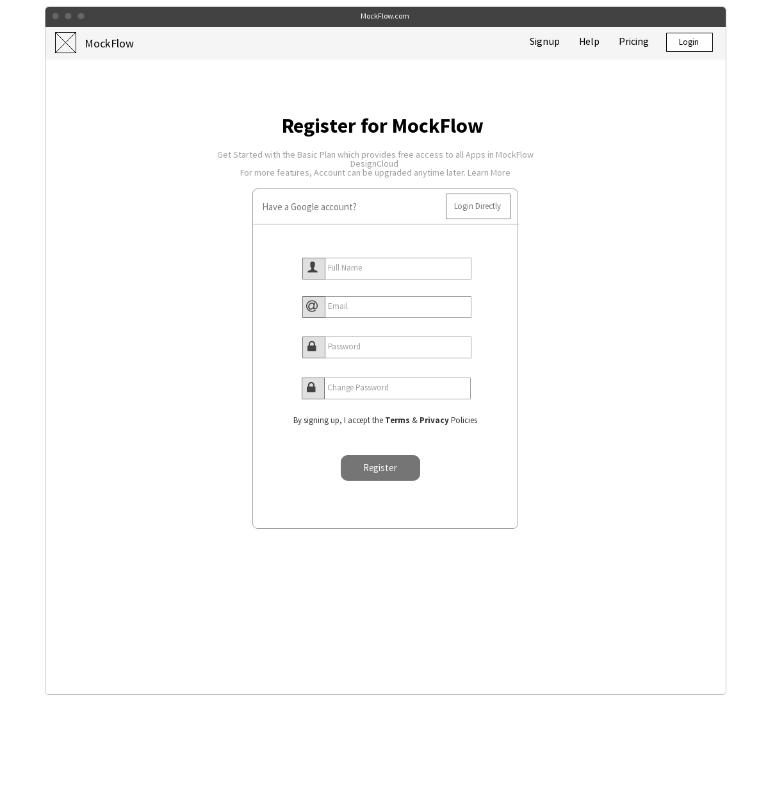
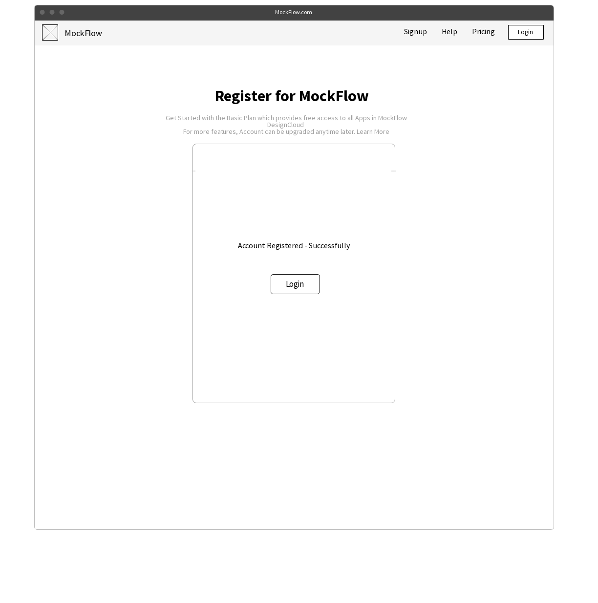
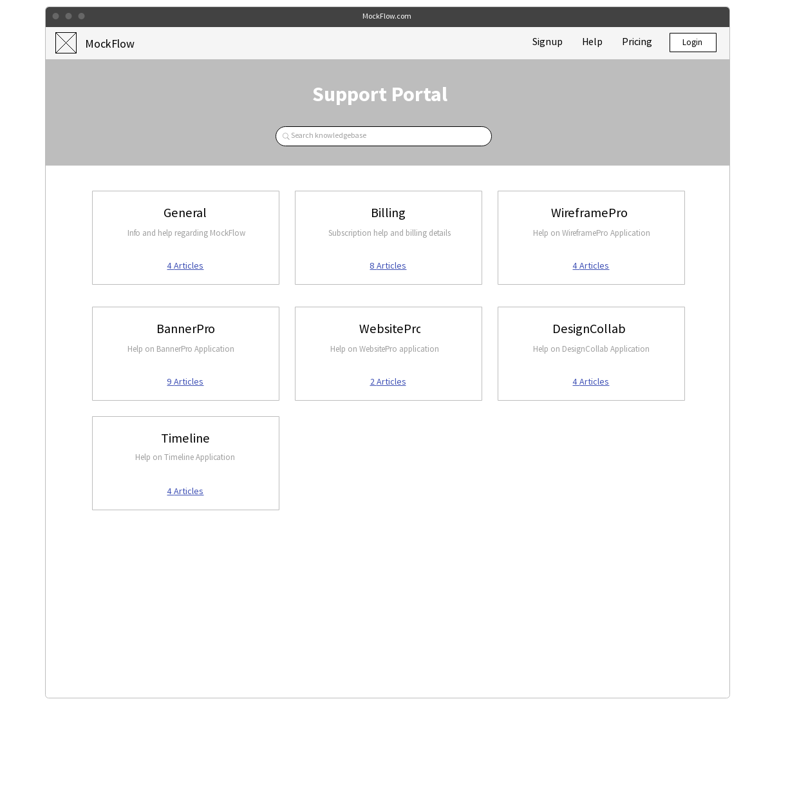
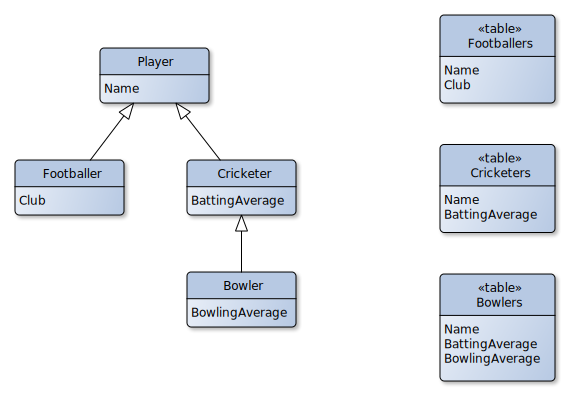

# Projektvorschlag Lorem ipsum 

**Hochschule Worms CSA 151 WS 2018/19**

Gruppe X  

Peter Schmidt  
inf1234567896@hs-worms.de   
Matrikelnummer: 123456789

Johannes Meier  
inf1234567896@hs-worms.de   
Matrikelnummer: 123456789

---

## Abstract

Lorem ipsum dolor sit amet, consectetur adipisicing elit. 
Architecto cupiditate delectus dignissimos doloribus eius laborum nulla odio quos reiciendis vero! 
Accusamus autem dignissimos dolores ducimus eos facilis illum incidunt ipsa minima natus pariatur perferendis quae quaerat, quia ratione reiciendis repellendus saepe sunt. 

Ad consequatur, culpa deserunt eaque eligendi esse in inventore ipsam magnam minima mollitia nihil nulla numquam quas quasi ratione sunt voluptatum? 
Animi aspernatur cum doloremque eaque eos facilis fugiat inventore laudantium perferendis quia. 
Ab accusantium aperiam corporis cupiditate, dicta dolor, ea earum est eveniet excepturi fugiat harum ipsa itaque libero magnam maxime necessitatibus nihil omnis pariatur perspiciatis praesentium provident quis quo recusandae, reprehenderit similique ullam. 

Aliquid aspernatur eum hic ipsa non! 
Aut eos error ex expedita harum molestiae molestias perferendis porro rem, repellendus reprehenderit, vero. 

Ab eveniet maiores obcaecati omnis praesentium quisquam quos veniam voluptatibus. Ea, libero, ratione. Autem cupiditate dolorem et, magni minima minus nisi quaerat recusandae repellendus voluptatibus! A, accusamus accusantium deleniti ducimus eius eveniet fugit illo in molestiae, nisi quod, saepe tempore velit! Assumenda est nobis porro suscipit veniam.


## Abstract Client
Verantwortlicher: Peter Schmidt

Animi aspernatur commodi consequatur libero nesciunt nisi, praesentium quidem repellendus sit sunt. Maiores, officia omnis!

Consequuntur incidunt iste neque nihil nulla omnis quam, saepe veritatis. Corporis labore maiores modi.

Assumenda beatae deleniti distinctio earum eligendi harum illum in labore magni molestias nam, neque quaerat, quo sint sit totam voluptate voluptatum! Aliquam delectus dolorem ex laborum nihil odit tempora temporibus? Adipisci amet beatae culpa quae voluptatibus.

Ab eveniet maiores obcaecati omnis praesentium quisquam quos veniam voluptatibus. Ea, libero, ratione. Autem cupiditate dolorem et, magni minima minus nisi quaerat recusandae repellendus voluptatibus! A, accusamus accusantium deleniti ducimus eius eveniet fugit illo in molestiae, nisi quod, saepe tempore velit! Assumenda est nobis porro suscipit veniam.


## Wireframe


## Mobil

Assumenda beatae deleniti distinctio earum eligendi harum illum in labore magni molestias nam, neque quaerat, quo sint sit totam voluptate voluptatum! Aliquam delectus dolorem ex laborum nihil odit tempora temporibus? Adipisci amet beatae culpa quae voluptatibus.


## Desktop

Consequuntur incidunt iste neque nihil nulla omnis quam, saepe veritatis. Corporis labore maiores modi.

### Homepage

Lorem ipsum dolor sit amet, consectetur.



### Pricing

Cumque delectus laboriosam magnam maxime nam porro possimus quos recusandae!



### Signup

Autem cupiditate eius est ex iure necessitatibus officiis omnis porro quod sequi?


### Registered

Lorem ipsum dolor sit amet, consectetur.



### Support

Consequuntur incidunt iste neque nihil nulla omnis quam, saepe veritatis. Corporis labore maiores modi.





## Abstract Server
Verantwortlicher: Johannes Meier

Lorem ipsum dolor sit amet, consectetur adipisicing elit. Consequuntur incidunt iste neque nihil nulla omnis quam, saepe veritatis. Corporis labore maiores modi.


## ORM

Ab eveniet maiores obcaecati omnis praesentium quisquam quos veniam voluptatibus. Ea, libero, ratione. Autem cupiditate dolorem et, magni minima minus nisi quaerat recusandae repellendus voluptatibus! A, accusamus accusantium deleniti ducimus eius eveniet fugit illo in molestiae, nisi quod, saepe tempore velit! Assumenda est nobis porro suscipit veniam.

Autem cupiditate eius est ex iure necessitatibus officiis omnis porro quod sequi?

Consequuntur incidunt iste neque nihil nulla omnis quam, saepe veritatis. Corporis labore maiores modi.

Animi aspernatur commodi consequatur libero nesciunt nisi, praesentium quidem repellendus sit sunt. Maiores, officia omnis!




## API-Beschreibung
Lorem ipsum dolor sit amet, consectetur adipisicing elit. Ad consequuntur, doloribus hic impedit quaerat quam quas qui voluptas voluptatibus! Eius facere harum nisi repellendus vel.

### `GET /foo`
In dieser Route nimmt der Server Lorem entgegen.
Als Antwort liefert er ein ipsum dolor sit amet, consectetur adipisicing elit. Ad consequuntur, doloribus hic impedit quaerat quam quas qui voluptas voluptatibus! Eius facere harum nisi repellendus vel.

### `POST /foo`
Lorem ipsum dolor sit amet, consectetur adipisicing elit. Ad consequuntur, doloribus hic impedit quaerat quam quas qui voluptas voluptatibus! Eius facere harum nisi repellendus vel.

### `PUT /foo`
Animi aspernatur commodi consequatur libero nesciunt nisi, praesentium quidem repellendus sit sunt. Maiores, officia omnis!

### `DELETE /foo`
Consequuntur incidunt iste neque nihil nulla omnis quam, saepe veritatis. Corporis labore maiores modi.

### Template Object

Animi aspernatur commodi consequatur libero nesciunt nisi, praesentium quidem repellendus sit sunt. Maiores, officia omnis!


```javascript
{
  success: false,
  msg: "...."
}
```

Cumque delectus laboriosam magnam maxime nam porro possimus quos recusandae!

```javascript
{
  success: true,
  foo: "$bar"
}
```

## Aufwandsschätzungen

### Frontend

Verantwortlicher: Peter Schmidt

#### Projektvorbereitung 

Cumque delectus laboriosam magnam maxime nam porro possimus quos recusandae!

| Aufgabe                                  | Zeit in Std |
|------------------------------------------|------------:|
| Wireframe Mobil Lorem                    |  4          |
| Wireframe Desktop Lorem                  |  4          |
| Beschreibung Funktionen Lorem            |  4          |
| Wireframe Lorem2                         |  4          |
| Beschreibung Funktionen Lorem2           |  4          |
| Wireframe Lorem3                         |  4          |
| Beschreibung Funktionen Lorem4           |  4          |
| Verfassen des Projektvorschlags          |  8          |
| ...                                      |  ...        |
| **Summe**                                |  **...**    |


#### Implementierung

| Aufgabe                                  | Zeit in Std |
|------------------------------------------|------------:|
| HTML-Grundgerüst Lorem                   |  2          |
| HTML-Grundgerüst Lorem2                  |  2          |
| HTML-Grundgerüst Lorem3                  |  1          |
| SCSS-Styling Breakpoint small            |  4          |
| SCSS-Styling Breakpoint medium           |  4          |
| SCSS-Styling Breakpoint large            |  4          |
| Implementierung Funktion Lorem           |  6          |
| Implementierung Funktion Lorem2          |  6          |
| Implementierung Funktion Lorem3          |  4          |
| ...                                      |  ...        |
| **Summe**                                |  **...**    |

#### Dokumentation / Tests

| Aufgabe                                  | Zeit in Std |
|------------------------------------------|------------:|
| Dokumentation Funktion Lorem             |  4          |
| Dokumentation Funktion Lorem2            |  1          |
| Dokumentation Funktion Lorem3            |  2          |
| ...                                      |  ...        |
| Vergleich SOLL / IST Stunden             |  1          |
| **Summe**                                |  **...**    |

#### Zusammenfassung
| Teil                                     | Zeit in Std |
|------------------------------------------|------------:|
| Projektvorbereitung                      |   30        |
| Implementierung                          |  ...        |
| Dokumentation / Tests                    |  ...        |
| **Summe**                                |  100        |

### Backend

Verantwortlicher: Johannes Meier

#### Projektvorbereitung

| Aufgabe                                  | Zeit in Std |
|------------------------------------------|------------:|
| Backend Endpunkte / API - Beschreibung   |  5          |
| ORM                                      |  3          |
| Verfassen des Projektvorschlags          |  2          |
| Verfassen ...                            |  5          |
| Markdown                                 |  8          |
| ...                                      |  ...        |
| **Summe**                                |  **...**    |

#### Implementierung und Validierung

| Aufgabe                                  | Zeit in Std |
|------------------------------------------|------------:|
| Setup Framework                          |             |
| - Framework express                      |  0.25       |
| - Framework jest                         |  0.5        |
| - Framework ...                          |  0.25       |
| DB ...                                   |  0          |
| - Setup                                  |  4          |
| Implementierung Auth                     |  4          |
| Implementierung Lorem-Route              |  2          |
| Implementierung Lorem2-Route             |  1          |
| Implementierung Lorem3-Route             |  8          |
| Implementierung Lorem4-Route             |  4          |
| Implementierung Validierungsschemata     |  2          |
| Implementierung Validierung Route 1      |  0.5        |
| Implementierung Validierung Route 2      |  0.5        |
| ...                                      |  ...        |
| **Summe**                                |  **...**    |

#### Dokumentation / Tests

| Aufgabe                                  | Zeit in Std |
|------------------------------------------|------------:|
| Setup Tests                              |  4          |
| Test DB                                  |  1          |
| Test Lorem1-Route                        |  1          |
| Test Lorem2-Route                        |  0.2        |
| Test Lorem3-Route                        |  2          |
| API-Dokumentation Lorem1-Route           |  4          |
| API-Dokumentation Lorem2-Route           |  2          |
| API-Dokumentation Lorem3-Route           |  1          |
| API-Dokumentation Lorem4-Route           |  1          |
| Dokumentation Lorem1-Route               |  0.5        |
| Dokumentation Lorem2-Route               |  1          |
| Dokumentation Lorem3-Route               |  1          |
| Dokumentation Lorem4-Route               |  0.5        |
| ...                                      |  ...        |
| Vergleich SOLL / IST Stunden             |  1          |
| **Summe**                                |  **...**    |


#### Zusammenfassung
| Teil                                     | Zeit in Std |
|------------------------------------------|------------:|
| Projektvorbereitung                      |  ...        |
| Implementierung                          |  ...        |
| Dokumentation / Tests                    |  ...        |
| **Summe**                                |  100        |